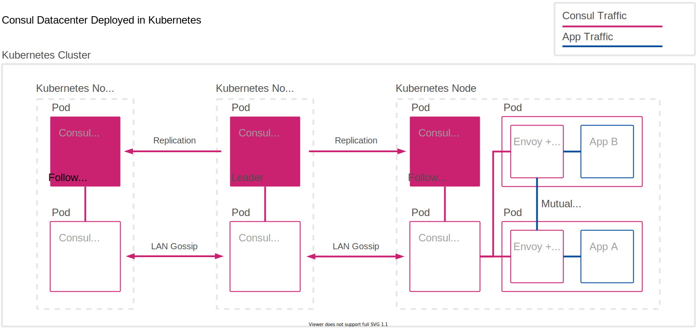

# HashiCorp Consul and Kubernetes

## Architecture


## Setup
```shell
# set path to google credentials
$ export GOOGLE_CREDENTIALS=<path_to_json>

# clone Consul helm chart
$ git clone git@github.com:hashicorp/consul-helm.git

# create a tfvars file
$ cat <<EOF > terraform.tfvars
project_id                   = "<redacted>"
cluster_name                 = "consul"
initial_node_count           = 3
consul_service_type          = "LoadBalancer"
preemptible                  = true
EOF

# initialize terraform
$ terraform init
Initializing modules...
- terraform-consul-gke in terraform-consul-gke
...
Terraform has been successfully initialized!
...

# build kubernetes cluster with consul
$ terraform apply

An execution plan has been generated and is shown below.
Resource actions are indicated with the following symbols:
  + create
...
Plan: 3 to add, 0 to change, 0 to destroy.

Do you want to perform these actions?
  Terraform will perform the actions described above.
  Only 'yes' will be accepted to approve.

  Enter a value: yes
...
Apply complete! Resources: 3 added, 0 changed, 0 destroyed.

Outputs:

connect = gcloud container clusters get-credentials consul --zone us-central1-a --project <redacted>
```


## Configure Consul DNS in Kubernetes with a stub-domain
```shell
# get the IP address of the DNS service
$ kubectl get svc consul-consul-dns -o jsonpath='{.spec.clusterIP}' -n consul
10.47.241.200

# create a ConfigMap to tell KubeDNS to use the Consul DNS
# service to resolve all domains ending with .consul
$ kubectl apply -f - <<EOF
apiVersion: v1
kind: ConfigMap
metadata:
  labels:
    addonmanager.kubernetes.io/mode: EnsureExists
  name: kube-dns
  namespace: kube-system
data:
  stubDomains: |
    {"consul": ["10.47.241.200"]}
EOF
Warning: kubectl apply should be used on resource created by either kubectl create --save-config or kubectl apply
configmap/kube-dns configured
```

## Query Consul DNS
```shell
# create a k8s job to run a dig against a Consul enabled service
$ kubectl apply -f - <<EOF
apiVersion: batch/v1
kind: Job
metadata:
  name: dig
spec:
  template:
    spec:
      containers:
        - name: dig
          image: anubhavmishra/tiny-tools
          command: ['dig', 'pokedex.service.arctiq.consul']
      restartPolicy: Never
  backoffLimit: 5
EOF

# get the name of the job
$ kubectl get pods
NAME        READY   STATUS      RESTARTS   AGE
dig-bbbsv   0/1     Completed   0          12s

# view the logs to verify we were able to discover the service
$ kubectl logs dig-bbbsv 
; <<>> DiG 9.11.2-P1 <<>> pokedex.service.arctiq.consul
;; global options: +cmd
;; Got answer:
;; ->>HEADER<<- opcode: QUERY, status: NOERROR, id: 19278
;; flags: qr aa rd ra; QUERY: 1, ANSWER: 1, AUTHORITY: 0, ADDITIONAL: 1

;; OPT PSEUDOSECTION:
; EDNS: version: 0, flags:; udp: 4096
;; QUESTION SECTION:
;pokedex.service.arctiq.consul.    IN      A

;; ANSWER SECTION:
pokedex.service.arctiq.consul. 0   IN      A       10.44.1.7

;; Query time: 2 msec
;; SERVER: 10.47.240.10#53(10.47.240.10)
;; WHEN: Thu May 28 14:43:36 UTC 2020
;; MSG SIZE  rcvd: 71
```